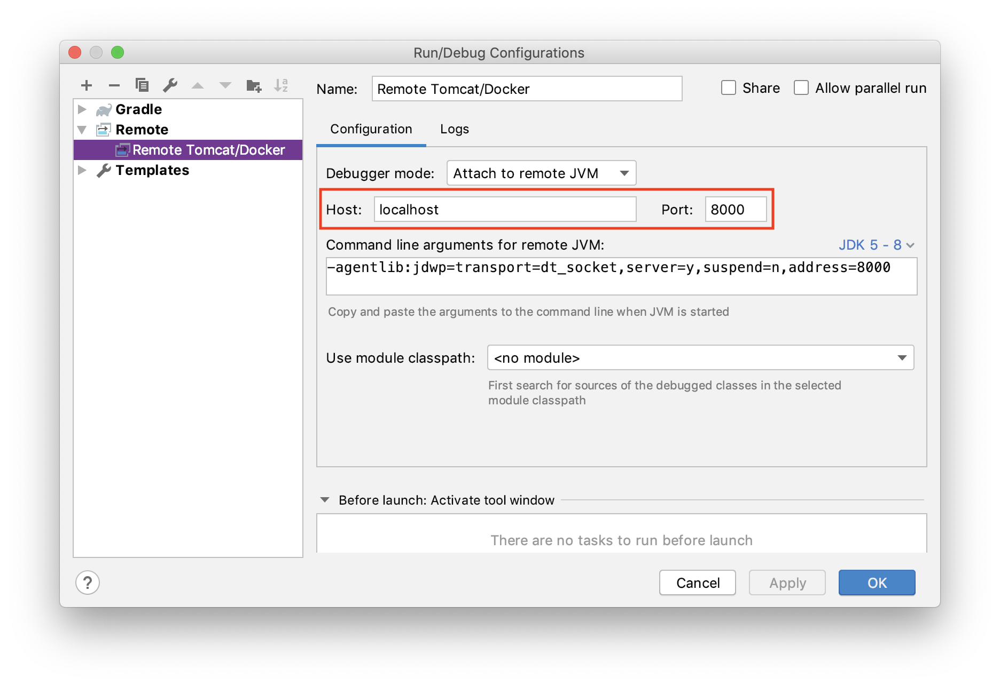
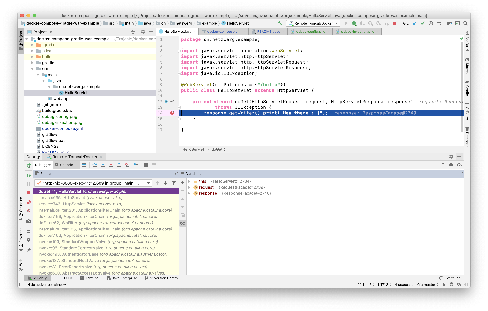

= docker-compose-gradle-war-example

A Gradle-based example project demonstrating hot-deploy of a Java web application to a dockerized Tomcat.

Build `*.war` via Gradle (continuous mode):

```
./gradlew -t build
```
Deploy to dockerized Tomcat:

```
docker-compose up
```

Access demo:

http://localhost:8080/docker-compose-gradle-war-example/hello

Try this:

* Change the source 👩🏼‍💻
* Watch how Gradle re-builds the `war` file 🎁
* Watch how Tomcat re-deploys the web app 💫
* Refresh the browser 🔄
* See your changes & celebrate! ✨

== Remote Debugging

The provided link:docker-compose.yml[docker-compose.yml] already contains the configuration necessary for remote debugging via JPDA (Java Platform Debugger Architecture).

Use your favorite IDE to connect to the target VM via `localhost:8000`:



Try this:

* Set a breakpoint in your source 🛑
* Refresh the browser 🔄
* Use the debugger to step through you code 🐞



== License

Licensed under link:LICENSE[MIT License].

&copy; Rahel Lüthy 2019
